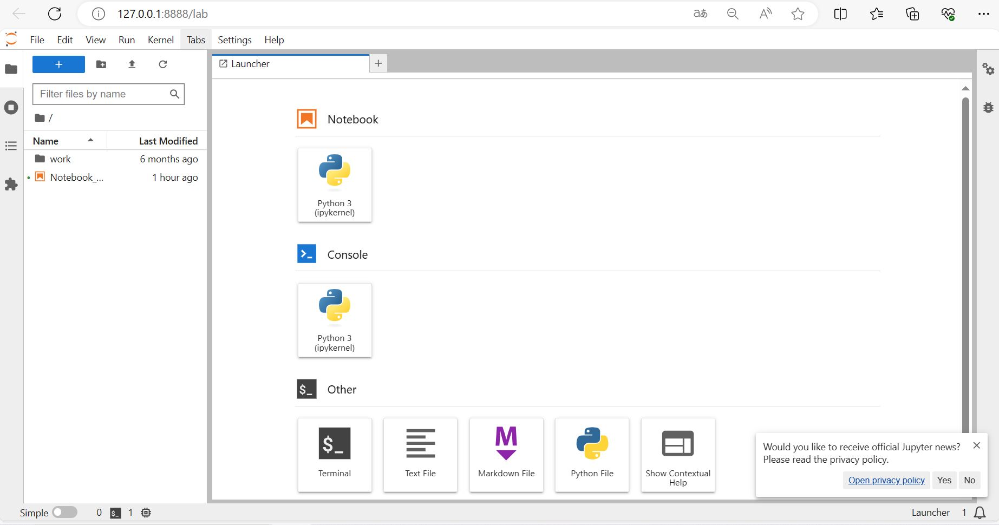
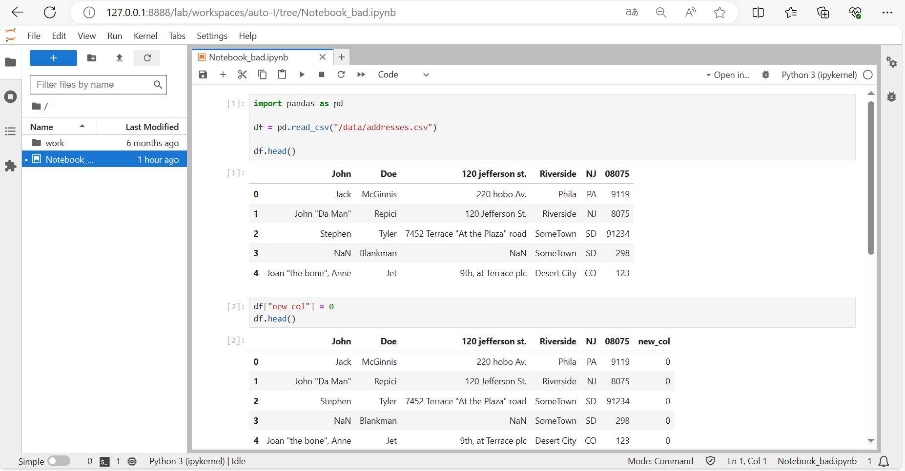

# Лабораторная работа №1

Были написаны два Dockerfile (хороший и плохой) для сборки образа, внутри которого можно запустить Jupyter с необходимыми DS-пакетами: pandas, matplotlib, numpy.

## Плохой вариант Dockerfile

Dockerfile находится в папке ```bad/```. Предварительно нужно зайти в эту папку.

### Команды сборки и запуска

Сборка образа:

```docker build -t test_jupyter_bad .```

Запуск контейнера:

```docker run -d -p 8888:8888 -v {PATH_TO_SRC_DATA_FOLDER}:"/data" test_jupyter_bad```, при этом папка с данными монтируется в контейнере.

*Примечание про volume:* 
более удобным кажется монтирование volume именно при запуске контейнера, а не внутри Dockerfile через инструкцию ```VOLUME```.

Причины:
- Инструкция задаёт только папку внутри контейнера, для которой будет создан volume. Примонтированная директория на хосте находится где-то внутри установки Docker, с помощью инструкции ```VOLUME``` её нельзя изменить
- Если нужно использовать данные из определённой директории и сохранять в эту же папку из контейнера более удобным кажется пробрасывание путей через флаг ```-v``` во время запуска контейнера

Результат:





### "Bad practices" в плохом Dockerfile
1. Использование образа с тегом ```"latest"``` (первая строчка): так по Dockerfile нельзя восстановить точную версию образа, поэтому нет воспроизводимости
2. Избыточное количество слоёв (целых 5 команд с установкой пакетов вынесены в отдельные слои) может привести в существенному увеличению размера итогового образа
3. Отсутствие инструкции ```EXPOSE``` при использовании портов: хоть эта инструкция не открывает порты, но она играет роль документации для того, кто будет собирать образ и запускать контейнер в дальнейшем

## Хороший вариант Dockerfile

Dockerfile находится в папке ```good/```. Предварительно нужно зайти в эту папку.

Сборка образа и запуск контейнера осуществляются аналогично.

### Исправление "bad practices" в Dockerfile
1. Использование в качестве тега образа конкретной версии, а не ```"latest"```
2. Объединение близких по смыслу команд в один слой с помощью ```&&```
3. Добавление инструкции ```EXPOSE``` с указанием номера порта, который будет использоваться при запуске

### Плохие практики по использованию данного контейнера
- использование другого номера порта (не 8888, который задан в Dockerfile) при запуске контейнера
- сохранять важные файлы внутри контейнера не в примонтированный volume: так после отключения контейнера файлы удалятся

## Случаи, когда НЕ нужно использовать контейнеры

1. Монолитное приложение: образ для монолита может оказаться слишком тяжеловесным, будет долгая сборка и замедление разработки

2. Небольшое простое приложение: если нужно запустить простой код без необходимости создания специфического окружения, то использование контейнеров в таком случае избыточно -- дольше образ собираться будет
