# Лабораторная работа №3

## Ход работы

### Установка minikube и развёртывание сервиса Nextcloud на БД PostgreSQL

1. Был установлен minikube:

    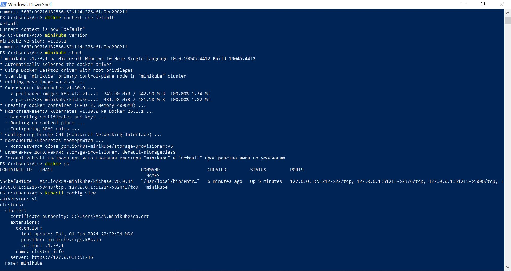

2. Были созданы манифесты конфигмапы, сервиса и деплоймента. Затем запущены с помощью команды ```kubectl create```:

    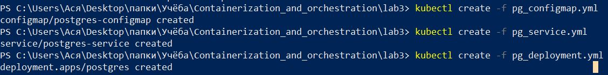

    Проверка того, что все ресурсы были успешно созданы:

    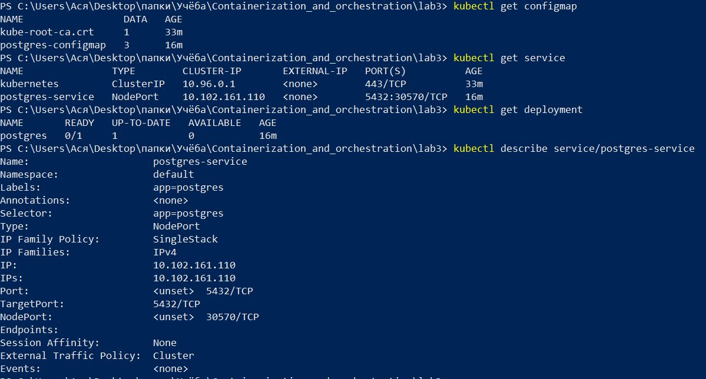

3. Был создан и запущен манифест Nextcloud:

    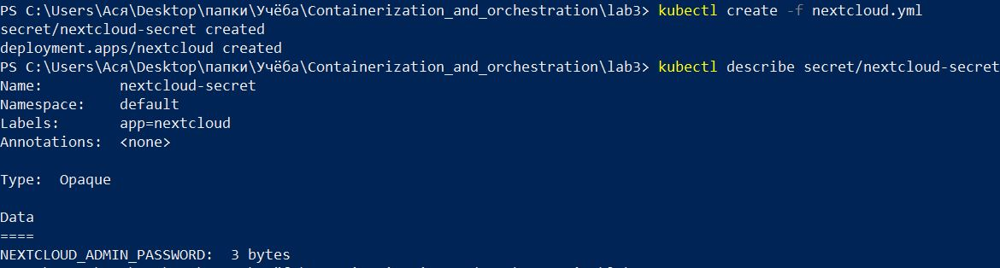

4. Проверка того, что поды были успешно запущены:

    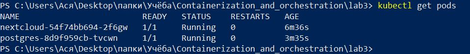

    В логах Nextcloud установка тоже завершилась успешно:

    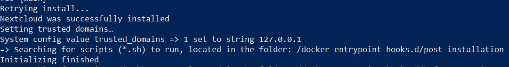

5. Ещё одна проверка создания ресурсов после добавления Nextcloud:

    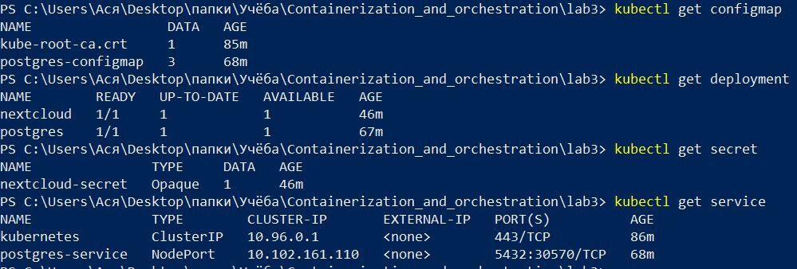

### Перенос переменных и добавление проб

- по аналогии с манифестом для Nextcloud креды для PostgreSQL были перенесены из конфигмапы в secret (см. ```pg_secret.yml```)

- для Nextcloud были перенесены переменные (```NEXTCLOUD_UPDATE```, ```ALLOW_EMPTY_PASSWORD``` и проч.) из деплоймента в конфигмапу (см. второй блок в ```nextcloud.yml```)

- также для Nextcloud были добавлены пробы готовности и работоспособности

- созданные и изменённые манифесты были перезапущены. В итоге получился следующий результат:

    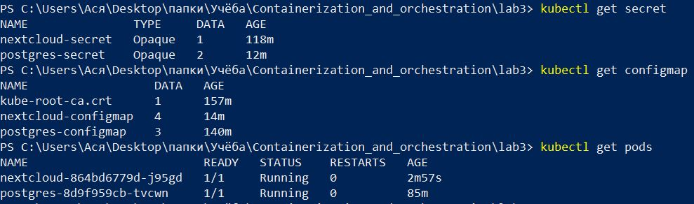

    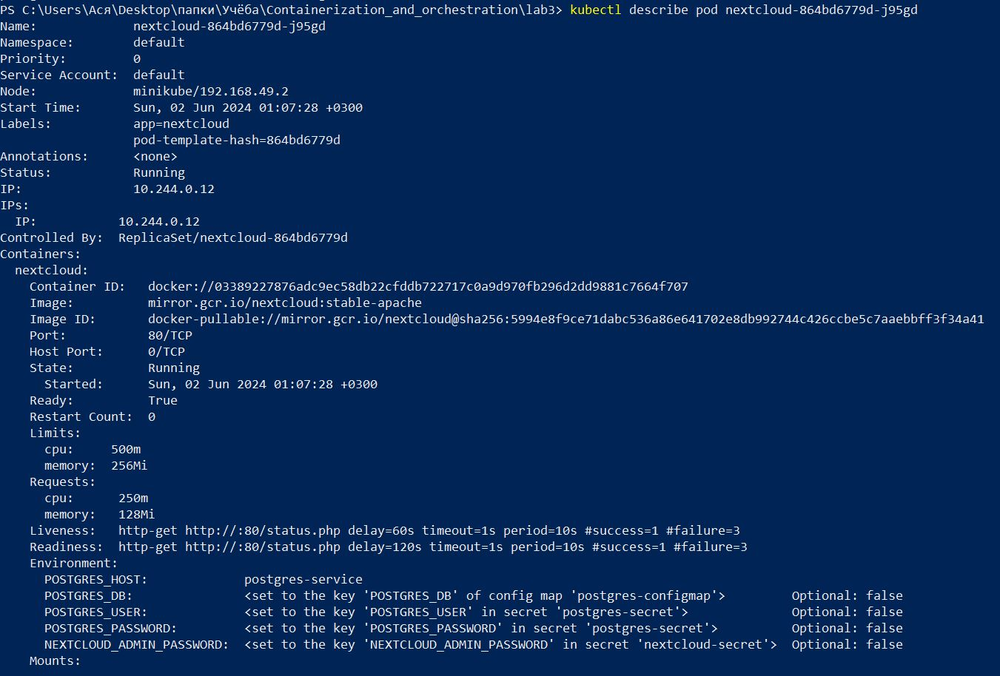

    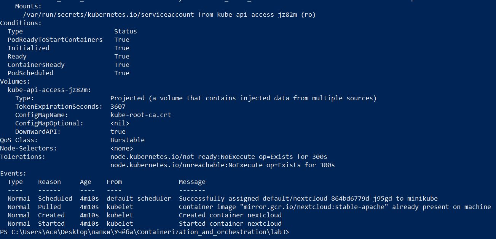

### Запуск итогового сервиса

- осуществляется последовательным запуском следующих команд:

    ```
    kubectl create -f  pg_configmap.yml
    kubectl create -f  pg_secret.yml
    kubectl create -f  pg_service.yml
    kubectl create -f  pg_deployment.yml
    kubectl create -f  nextcloud.yml
    ```

- финальная проверка подов:

    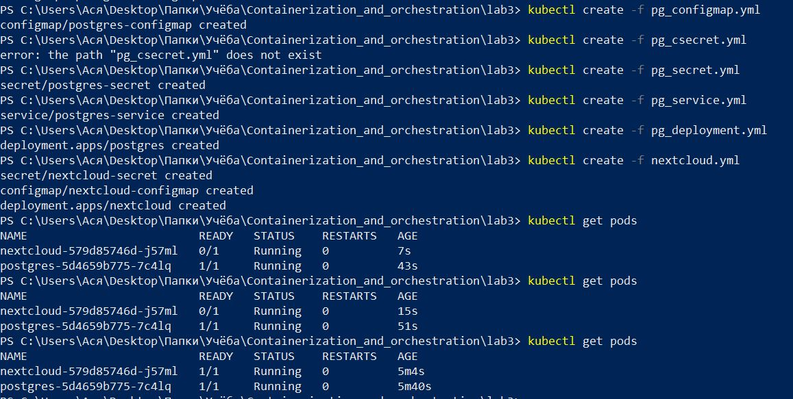

- дашборд из дополнительного задания:

    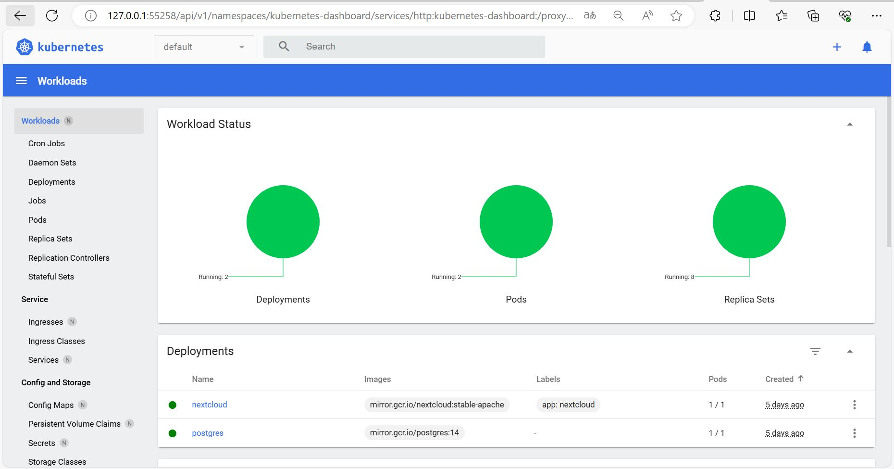

## Ответы на вопросы

1. Важен ли порядок выполнения этих манифестов? Почему?

    Ответ: Да, важен. Так как, например, манифест деплоймента зависит от конфигмапы -- в нашем примере конфигмапа задаёт параметры, необходимые для подключения к базе данных. Если запустить деплоймент до конфигмапы, то он запустится с ошибкой.

2. Что (и почему) произойдет, если отскейлить количество реплик postgres-deployment в 0, затем обратно в 1, после чего попробовать снова зайти на Nextcloud?

    Ответ: Если сделать количество реплик postgres-deployment равным 0, то все поды PostgreSQL будут остановлены, из-за чего база данных будет недоступна для Nextcloud (в таком случае Nextcloud будет выдавать ошибку о недоступности БД). При дальнейшем изменении количества реплик postgres-deployment до 1 будет создан под PostgreSQL. БД снова станет доступна для Nextcloud, он перестанет выдавать ошибки и успешно запустится.