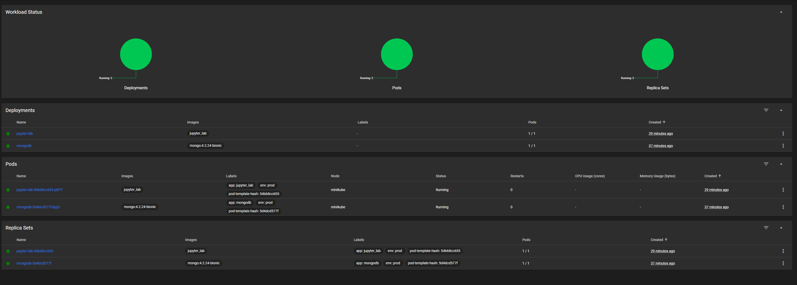
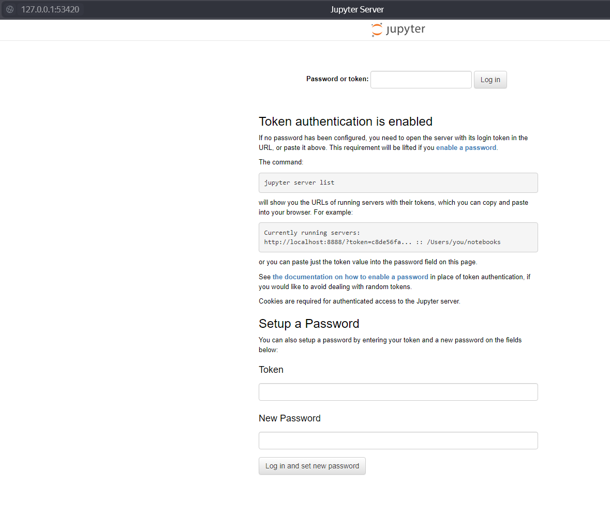

# Лабораторная работа №4

## Deployment-ы

1. **jupyter_lab** - деплоймент jupyter. Используется кастомный докер-образ. Реализованы Liveness и Readiness пробы. Используется 80 порт. Помимо этого есть Service для пробрасывания порта вовне, порт прикреплен к ноде, ConfigMap, чтобы задавать порт, используемый в докере (не надо пересобирать образ при изменении порта в деплойменте), и подключен Secret с данными для авторизации в MongoDB (для простоты подключен весь, а не отдельные переменные).
2. **mongo** - деплоймент MongoDB. Используется публичный образ Монго. Подключено volume. Есть Secret, в котором хранятся данные для админского доступа. В этом деплойменте также есть примитивный init-контейнер, который запускает ничего не делающий баш-скрипт. Образ контейнера кастомный.

## Ход работы 

Ход работы был довольно спонтанным, не все получалось сразу, поэтому не знаю, как его описать. Много проблем возникло с тем, как запуллить кастомный образ в minikube, по итогу нашел решение, но до этого пробовал много разного, в том числе поднять отдельным деплойментом свой registry в кластере, не получилось. Особенности работы докера под виндой добавили сложностей: например, чтобы запуллить докером локальный образ в registry, поднятый на определенном порте в minikube, необходимо создать отдельный тоннель для докера:
```
docker run --rm -it --network=host alpine ash -c "apk add socat && socat TCP-LISTEN:52433,reuseaddr,fork TCP:host.docker.internal:52433"
```
Все потому, что докер не имеет прямого доступа к локальной сети, как я понял.

## Запуск кластера
Итоговая последовательность действий выглядит так.

Запускаем minikube:
```
minikube start
```

Локально собираем нужные образы и тегируем (подразумевается выполнение команд из папки лабы):
```
docker build -f .\db_init.Dockerfile -t custom_mongo_init .
docker build -f .\Dockerfile -t jupyter_lab .    
```

Загружаем образы в minikube:
```
minikube image load jupyter_lab
minikube image load custom_mongo_init
```

Добавляем манифесты:
```
kubectl create -f .\mongo_secret.yml
kubectl create -f .\mongo.yml
kubectl create -f .\jupyter_lab_configmap.yml
kubectl create -f .\jupyter_lab_service.yml
kubectl create -f .\jupyter_lab.yml
```

Можем использовать дэш (или через cli), чтобы увидеть, как все поднялось:
```
minikube dashboard --url
```


Для того, чтобы попасть в Jupyter запускаем:
```
minikube service jupyter-lab-service
```
Нас перебрасывает на случайный (не стал задавать фиксированный) порт, где мы видим окно входа:

